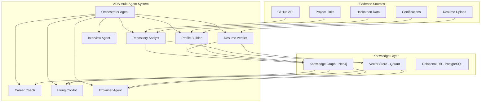
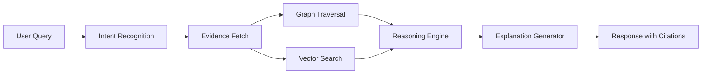

# ADA — Adaptive Decision Assistant

## Overview

ADA is the intelligence layer powering TalentGraph AI.

ADA is **not** a chatbot. ADA is a multi-agent AI system that:

- Collects and verifies evidence from multiple sources
- Builds and maintains Professional Digital Twins
- Reasons over structured knowledge to provide insights
- Generates explainable recommendations for hiring decisions
- Guides candidates through career development

Every major interaction on the platform is powered by ADA.

---

## Name

**A.D.A.** — Adaptive Decision Assistant

- **Adaptive**: Continuously learns from new evidence and evolves its understanding.
- **Decision**: Designed to support high-quality decision-making, not just information retrieval.
- **Assistant**: Augments human judgment — never replaces it.

---

## Architecture

ADA is built as a **multi-agent system** using LangGraph, where specialized agents collaborate to fulfill complex tasks.



---

## Agent Responsibilities

### Orchestrator Agent

The central coordinator. Routes user requests to the appropriate specialized agents, manages conversation context, and synthesizes responses from multiple agents.

**Responsibilities:**
- Parse user intent
- Route to appropriate agent(s)
- Aggregate multi-agent responses
- Maintain conversation state
- Handle fallbacks and error recovery

### Repository Analyst

Analyzes GitHub repositories to extract structured engineering intelligence.

**Capabilities:**
- Clone and analyze repository structure
- Parse code using Tree-sitter for AST analysis
- Evaluate code quality metrics (complexity, maintainability, test coverage)
- Analyze commit history patterns (frequency, quality, collaboration)
- Identify technologies, frameworks, and architectural patterns
- Assess contribution authenticity (detect superficial vs. meaningful commits)
- Generate repository intelligence summaries

**Evidence Output:**
- Technology proficiency scores
- Code quality indicators
- Architecture sophistication level
- Collaboration patterns
- Contribution authenticity score

### Resume Verifier

Cross-references resume claims against collected evidence.

**Capabilities:**
- Parse resumes using PaddleOCR and structured extraction
- Compare claimed skills against GitHub evidence
- Verify employment timelines against commit histories
- Flag unverifiable or inconsistent claims
- Generate Evidence Confidence Scores per claim

**Evidence Output:**
- Claim verification status (Verified / Partial / Unverified / Contradicted)
- Evidence Confidence Score per skill
- Discrepancy report

### Profile Builder

Constructs and maintains the Professional Digital Twin.

**Capabilities:**
- Aggregate evidence from all sources
- Build skill taxonomy with proficiency levels
- Create project portfolio with complexity assessments
- Map career trajectory and growth patterns
- Generate professional summary

### Interview Agent

Conducts AI-powered adaptive interviews.

**Capabilities:**
- Generate role-specific interview questions based on the Digital Twin
- Adapt question difficulty based on responses
- Transcribe responses using Whisper
- Evaluate technical depth and communication quality
- Generate interview intelligence reports

### Career Coach

Guides candidates through professional development.

**Capabilities:**
- Identify skill gaps relative to target roles
- Recommend learning paths
- Simulate "what-if" career scenarios
- Track progress over time
- Suggest projects and contributions for growth

### Hiring Copilot

Assists recruiters in candidate discovery and evaluation.

**Capabilities:**
- Natural language candidate search ("Find me a senior backend engineer who has contributed to distributed systems")
- Evidence-backed candidate ranking
- Side-by-side candidate comparison with explainable rationale
- Generate hiring reports with strengths, weaknesses, and interview suggestions

### Explainer Agent

Ensures every recommendation is transparent and traceable.

**Capabilities:**
- Trace any recommendation back to specific evidence
- Generate natural language explanations for rankings
- Produce audit trails for hiring decisions
- Identify and flag potential bias indicators

---

## How ADA Reasons

ADA uses a combination of:

1. **GraphRAG** — Retrieval-augmented generation over the Knowledge Graph, combining semantic search with graph traversal for context-rich responses.

2. **Structured Reasoning** — Multi-step reasoning chains that follow evidence → analysis → conclusion → explanation.

3. **Evidence Weighting** — Not all evidence is equal. Recent, verified, high-quality evidence is weighted more heavily than old, unverified, or superficial evidence.



---

## Example Interactions

### Candidate: "Am I ready for a Senior Backend Engineer role?"

ADA would:

1. Retrieve the candidate's Digital Twin
2. Compare against a Senior Backend Engineer skill profile
3. Identify strengths (e.g., "You have 3 years of Go experience with production-grade microservices")
4. Identify gaps (e.g., "Limited evidence of distributed systems design at scale")
5. Provide a readiness assessment with specific evidence citations
6. Suggest actions to close gaps

### Recruiter: "Why was Candidate A ranked higher than Candidate B?"

ADA would:

1. Retrieve both Digital Twins
2. Compare against the job requirements
3. Generate a structured comparison:
   - Skills alignment (with evidence)
   - Code quality metrics (with repository links)
   - Architecture sophistication (with specific examples)
   - Growth trajectory (with commit history analysis)
4. Explain the ranking with traceable evidence for each factor

### Candidate: "What happens if I spend 3 months contributing to Kubernetes?"

ADA would:

1. Simulate the Digital Twin update with hypothetical Kubernetes contributions
2. Re-evaluate role readiness scores
3. Identify which skill gaps would be closed
4. Show how ranking would change for specific job types
5. Provide a concrete action plan

---

## ADA Design Principles

1. **Never hallucinate.** Every claim must be backed by evidence. If evidence is insufficient, ADA says so.
2. **Always explain.** No recommendation without rationale. No score without evidence.
3. **Adapt continuously.** ADA's understanding of a candidate must evolve with every new piece of evidence.
4. **Augment, don't replace.** ADA supports human decision-making — it does not make hiring decisions.
5. **Bias-aware.** ADA must actively monitor for and flag potential bias in its reasoning.

---

## Technical Implementation

### LangGraph State Machine

ADA agents are implemented as nodes in a LangGraph state graph:

```python
# Conceptual structure
class ADAState(TypedDict):
    messages: list[BaseMessage]
    evidence: dict
    digital_twin: dict
    current_agent: str
    reasoning_chain: list[str]
    confidence: float

graph = StateGraph(ADAState)
graph.add_node("orchestrator", orchestrator_agent)
graph.add_node("repository_analyst", repo_analyst_agent)
graph.add_node("resume_verifier", resume_verifier_agent)
graph.add_node("profile_builder", profile_builder_agent)
graph.add_node("career_coach", career_coach_agent)
graph.add_node("hiring_copilot", hiring_copilot_agent)
graph.add_node("explainer", explainer_agent)
```

### Model Stack

| Component | Model | Purpose |
|-----------|-------|---------|
| Reasoning | Qwen 2.5 72B | Complex multi-step reasoning |
| Code Analysis | DeepSeek Coder V2 | Repository and code understanding |
| Embeddings | BGE-M3 | Semantic search over evidence |
| Transcription | Whisper Large V3 | Interview audio processing |
| OCR | PaddleOCR | Resume and document parsing |

All models run locally via **Ollama** for privacy, cost control, and latency.

---

## Future Scope

- **Real-time evidence monitoring** — Automatically detect and process new GitHub activity.
- **Multi-modal evidence** — Analyze video presentations, conference talks, and technical blog posts.
- **Team composition analysis** — Recommend team configurations based on complementary skill profiles.
- **Predictive career modeling** — Project long-term career trajectories based on current evidence patterns.
- **Federated learning** — Learn from hiring outcomes across organizations without sharing sensitive data.
