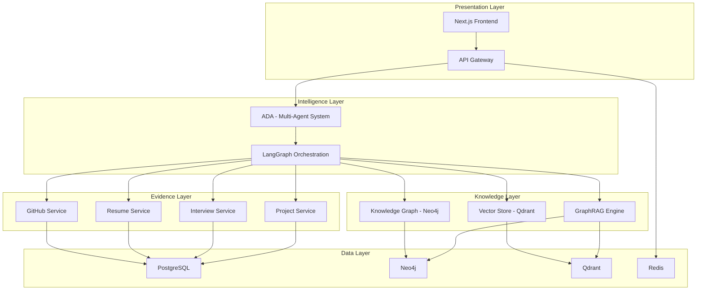
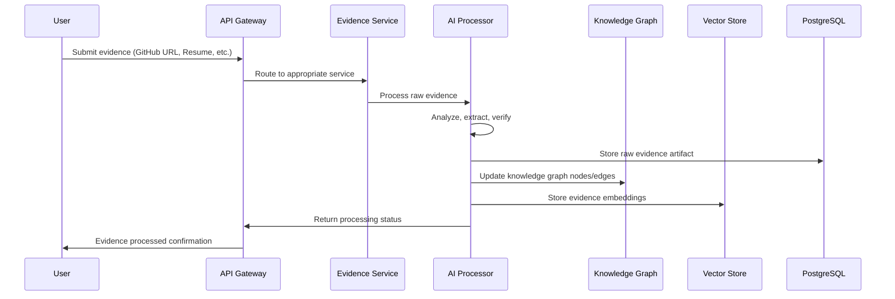
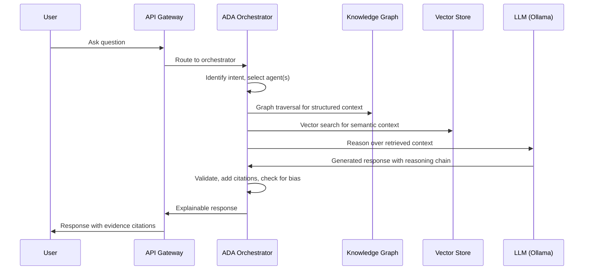
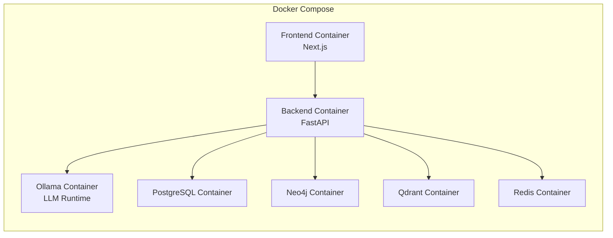

# System Architecture

## Overview

TalentGraph AI is a multi-layered system designed around a single principle: **evidence flows in, intelligence flows out.**

The architecture separates concerns into five distinct layers, each with clear responsibilities and well-defined interfaces.

---

## Layer Breakdown

### 1. Presentation Layer

**Responsibility:** User interface and API gateway.

| Component | Technology | Purpose |
|-----------|-----------|---------|
| Frontend | Next.js (App Router) + TypeScript | Candidate and recruiter dashboards |
| API Gateway | FastAPI | REST + WebSocket endpoints |
| Caching | Redis | Session management, rate limiting, response caching |

**Key Design Decisions:**
- Server-side rendering for SEO and initial load performance
- WebSocket connections for real-time ADA conversations
- API gateway handles authentication, rate limiting, and request routing
- Frontend is a thin presentation layer — no business logic

### 2. Intelligence Layer

**Responsibility:** AI reasoning, agent orchestration, and decision support.

| Component | Technology | Purpose |
|-----------|-----------|---------|
| Agent System | LangGraph | Multi-agent orchestration and state management |
| LLM Runtime | Ollama | Local model inference (Qwen, DeepSeek) |
| Embeddings | BGE-M3 via Ollama | Semantic embedding generation |
| Transcription | Whisper | Audio-to-text for interviews |
| OCR | PaddleOCR | Document parsing for resumes |

**Key Design Decisions:**
- All models run locally via Ollama — no external API dependencies for inference
- LangGraph provides deterministic agent routing with state persistence
- Each agent is a self-contained module with defined input/output contracts
- Reasoning chains are logged for auditability and debugging

### 3. Knowledge Layer

**Responsibility:** Structured knowledge representation and retrieval.

| Component | Technology | Purpose |
|-----------|-----------|---------|
| Knowledge Graph | Neo4j | Relationship-rich data (skills, projects, technologies) |
| Vector Store | Qdrant | Semantic search over evidence embeddings |
| GraphRAG | Custom | Hybrid retrieval combining graph traversal + vector similarity |

**Key Design Decisions:**
- Neo4j stores the structured Professional Digital Twin as a graph
- Qdrant stores dense embeddings of evidence artifacts (code, text, summaries)
- GraphRAG combines both for context-rich retrieval — graph for structure, vectors for semantics
- Knowledge is incrementally updated as new evidence arrives

### 4. Evidence Layer

**Responsibility:** Evidence collection, processing, and verification.

| Service | Input | Output |
|---------|-------|--------|
| GitHub Service | Repository URLs | Code analysis, contribution metrics, technology proficiency |
| Resume Service | PDF/Image uploads | Parsed claims, extracted skills, employment timeline |
| Interview Service | Audio/Video streams | Transcripts, response evaluations, communication scores |
| Project Service | Project URLs/descriptions | Complexity assessment, technology mapping |

**Key Design Decisions:**
- Each evidence service is a standalone FastAPI module
- Services produce structured evidence artifacts with confidence scores
- Evidence is immutable once processed — new versions create new artifacts
- All evidence is timestamped for temporal reasoning

### 5. Data Layer

**Responsibility:** Persistent storage across multiple paradigms.

| Database | Purpose | Key Data |
|----------|---------|----------|
| PostgreSQL | Relational data | Users, evidence artifacts, audit logs, job definitions |
| Neo4j | Graph data | Skills, technologies, projects, relationships, Digital Twins |
| Qdrant | Vector data | Evidence embeddings, code embeddings, semantic search indices |
| Redis | Ephemeral data | Sessions, caches, rate limits, real-time state |

---

## Data Flow

### Evidence Ingestion Flow

### Query Flow (ADA Interaction)

---

## Infrastructure

### Deployment Architecture

### Container Specifications

| Container | Base Image | Exposed Port | Resources |
|-----------|-----------|-------------|-----------|
| Frontend | node:20-alpine | 3000 | 512MB RAM |
| Backend | python:3.12-slim | 8000 | 2GB RAM |
| Ollama | ollama/ollama | 11434 | 8GB+ RAM (GPU recommended) |
| PostgreSQL | postgres:16-alpine | 5432 | 1GB RAM |
| Neo4j | neo4j:5-community | 7474, 7687 | 2GB RAM |
| Qdrant | qdrant/qdrant | 6333, 6334 | 1GB RAM |
| Redis | redis:7-alpine | 6379 | 256MB RAM |

---

## Security Considerations

1. **Authentication**: JWT-based authentication with refresh token rotation.
2. **Authorization**: Role-based access control (Candidate, Recruiter, Admin).
3. **Data Isolation**: Candidates can only access their own Digital Twin. Recruiters see anonymized data until shortlisting.
4. **API Security**: Rate limiting, input validation, CORS configuration.
5. **Model Security**: All AI models run locally — no data leaves the deployment environment.
6. **Audit Logging**: Every ADA interaction is logged with full reasoning chains for accountability.

---

## Scalability Path

### Phase 1: Single Instance (Hackathon / MVP)
- Docker Compose on a single machine
- Ollama with quantized models (Q4/Q8)
- Suitable for 10–100 users

### Phase 2: Multi-Instance
- Kubernetes deployment
- Horizontal scaling of API and evidence services
- Dedicated GPU nodes for Ollama
- Suitable for 100–10,000 users

### Phase 3: Production Scale
- Managed database services
- Model serving infrastructure (vLLM / TGI)
- Event-driven evidence processing (message queues)
- CDN for frontend assets
- Suitable for 10,000+ users

---

## Cross-Cutting Concerns

### Observability
- Structured logging with correlation IDs
- Metrics collection (Prometheus format)
- Distributed tracing for multi-agent interactions

### Error Handling
- Graceful degradation when evidence services are unavailable
- Retry with exponential backoff for external API calls
- Circuit breakers for dependent services

### Performance
- Redis caching for frequently accessed Digital Twin summaries
- Lazy loading of evidence details
- Batch processing for bulk evidence ingestion
- Connection pooling for all database connections
