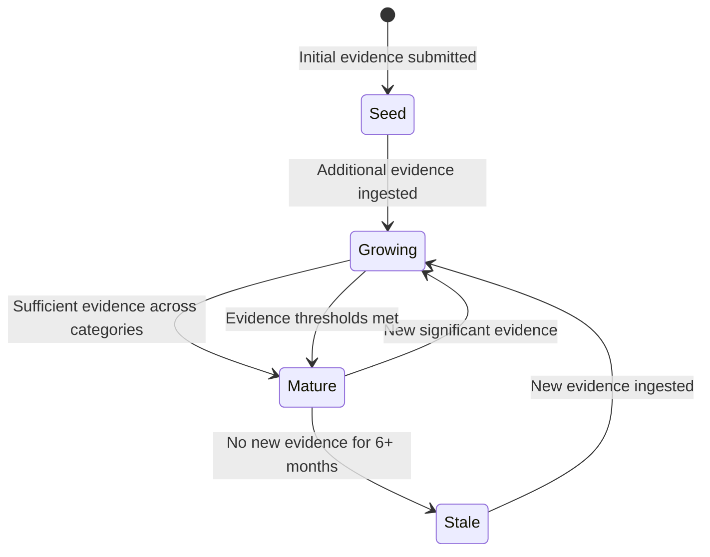

# Professional Digital Twin

## Overview

The Professional Digital Twin is the central concept of TalentGraph AI.

It is a **living, continuously evolving, evidence-backed model** of a candidate's professional capabilities. Unlike a static resume that captures a moment in time, the Digital Twin grows and changes with every new piece of evidence.

---

## What Is a Digital Twin?

In manufacturing, a digital twin is a virtual replica of a physical system — updated in real-time with sensor data, used for simulation, monitoring, and prediction.

A **Professional Digital Twin** applies this concept to careers:

| Manufacturing Twin | Professional Twin |
|---|---|
| Sensor data | Evidence (GitHub, projects, interviews) |
| Physical system model | Professional capability model |
| Real-time monitoring | Continuous evidence ingestion |
| Predictive maintenance | Career growth prediction |
| Performance simulation | Role readiness simulation |

---

## Digital Twin Structure

```mermaid
graph TD
    DT[Professional Digital Twin]
    
    DT --> SK[Skill Graph]
    DT --> PF[Project Portfolio]
    DT --> CT[Career Trajectory]
    DT --> EV[Evidence Index]
    DT --> RP[Reputation Profile]
    
    SK --> SK1[Technical Skills]
    SK --> SK2[Soft Skills]
    SK --> SK3[Domain Knowledge]
    
    PF --> PF1[Personal Projects]
    PF --> PF2[Open Source Contributions]
    PF --> PF3[Professional Work]
    
    CT --> CT1[Growth Velocity]
    CT --> CT2[Role Progression]
    CT --> CT3[Specialization Path]
    
    EV --> EV1[GitHub Evidence]
    EV --> EV2[Resume Evidence]
    EV --> EV3[Interview Evidence]
    EV --> EV4[Certification Evidence]
    
    RP --> RP1[Community Impact]
    RP --> RP2[Collaboration Quality]
    RP --> RP3[Mentorship Activity]
```



---

## Components

### 1. Skill Graph

A weighted, hierarchical graph of technical and soft skills.

**Structure:**
```
Skill Category → Skill → Sub-skill
```

**Example:**
```
Backend Development
├── Go (Proficiency: Advanced, Evidence: 12 repos, 3 years)
│   ├── Concurrency Patterns (Evidence: 4 repos)
│   ├── gRPC Services (Evidence: 2 repos)
│   └── Testing (Evidence: 8 repos, 85% coverage avg)
├── Python (Proficiency: Intermediate, Evidence: 5 repos, 1.5 years)
│   ├── FastAPI (Evidence: 3 repos)
│   └── Data Processing (Evidence: 2 repos)
└── Databases
    ├── PostgreSQL (Proficiency: Advanced, Evidence: 7 repos)
    └── Redis (Proficiency: Intermediate, Evidence: 3 repos)
```

**Each skill node contains:**
- Proficiency level (Beginner → Intermediate → Advanced → Expert)
- Evidence count and sources
- First seen / Last seen timestamps
- Growth velocity (how quickly the skill is improving)
- Confidence score (how much evidence supports the assessment)

### 2. Project Portfolio

A curated collection of the candidate's work, automatically analyzed for complexity and impact.

**Per-project attributes:**
- Repository / URL
- Technologies used (detected, not self-reported)
- Complexity score (architecture, dependency graph, code sophistication)
- Contribution type (solo / team lead / contributor)
- Code quality metrics (maintainability, test coverage, documentation)
- Impact indicators (stars, forks, issues resolved, downstream dependents)

### 3. Career Trajectory

A temporal model of professional growth.

**Metrics:**
- **Growth Velocity**: How quickly the candidate acquires new skills and deepens existing ones.
- **Specialization Path**: Whether the candidate is generalizing or specializing, and in which direction.
- **Role Readiness**: Calculated fit for specific role archetypes (e.g., Senior Backend, Staff Engineer, SRE).
- **Progression Pattern**: Is growth accelerating, plateauing, or declining?

### 4. Evidence Index

A complete, traceable index of every piece of evidence that contributes to the Digital Twin.

**Per-evidence attributes:**
- Source (GitHub, Resume, Interview, Certification, etc.)
- Type (Code, Document, Audio, Certificate)
- Ingestion timestamp
- Processing status
- Confidence score
- Linked skills and projects
- Verification status

### 5. Reputation Profile

A model of the candidate's professional impact beyond individual skills.

**Dimensions:**
- **Community Impact**: Open source contributions, mentorship, knowledge sharing.
- **Collaboration Quality**: PR review quality, communication in issues, team dynamics.
- **Mentorship Activity**: Evidence of teaching, onboarding, or guiding others.

---

## Knowledge Graph Representation

The Digital Twin is stored as a subgraph within Neo4j:

```cypher
// Core Twin node
(candidate:Candidate {id, name, created_at, updated_at})

// Skills
(candidate)-[:HAS_SKILL {proficiency, confidence, first_seen, last_seen}]->(skill:Skill {name, category})

// Projects
(candidate)-[:OWNS_PROJECT]->(project:Project {name, url, complexity_score})
(project)-[:USES_TECHNOLOGY]->(tech:Technology {name})
(project)-[:DEMONSTRATES_SKILL {evidence_strength}]->(skill)

// Evidence
(evidence:Evidence {source, type, timestamp, confidence})-[:SUPPORTS]->(skill)
(evidence)-[:BELONGS_TO]->(project)

// Career
(candidate)-[:HAS_TRAJECTORY]->(trajectory:Trajectory {velocity, pattern, specialization})
```

---

## Twin Evolution

The Digital Twin is not static. It evolves through a defined lifecycle:



### Evolution Rules

1. **New evidence always triggers a Twin update.** No batch processing delays.
2. **Confidence scores decay over time.** A skill demonstrated 3 years ago with no recent evidence loses confidence.
3. **Conflicting evidence triggers verification.** If a resume claims "Expert in Rust" but no Rust code exists in GitHub, the skill is flagged.
4. **Growth velocity is calculated over rolling windows.** Recent growth is weighted more heavily than historical growth.

---

## Role Readiness Model

The Digital Twin includes **role readiness scores** — how well the candidate's current capabilities match specific role archetypes.

**Example Role Archetype: Senior Backend Engineer**

| Requirement | Weight | Candidate Score | Evidence |
|---|---|---|---|
| 3+ years backend experience | 0.2 | 0.9 | 4 years of Go commits |
| Distributed systems knowledge | 0.25 | 0.4 | Limited microservice evidence |
| Database design proficiency | 0.15 | 0.8 | 7 repos with PostgreSQL |
| API design experience | 0.15 | 0.9 | 5 repos with REST/gRPC |
| System design capability | 0.15 | 0.3 | No architecture docs found |
| Mentorship evidence | 0.1 | 0.6 | Some PR reviews |
| **Weighted Readiness** | | **0.62** | |

ADA uses this model to answer questions like "Am I ready for this role?" with specific, evidence-backed guidance.

---

## Privacy and Ownership

1. **Candidates own their Digital Twin.** They control what evidence is included and who can view it.
2. **Recruiters see aggregated intelligence, not raw evidence** (unless the candidate grants access).
3. **Twins are portable.** Candidates can export their Twin data.
4. **Deletion is complete.** When a candidate deletes their account, all Twin data is permanently removed.

---

## Future Capabilities

- **Twin Comparison**: Side-by-side comparison of two candidates' Twins for a specific role.
- **Twin Simulation**: "What if I learn Kubernetes for 3 months?" — simulate Twin changes.
- **Twin Marketplace**: Candidates opt-in to be discoverable by recruiters through their Twin.
- **Team Twin**: Aggregate Twin representing an entire team's collective capabilities.
- **Organization Twin**: Company-level view of engineering capabilities and gaps.
