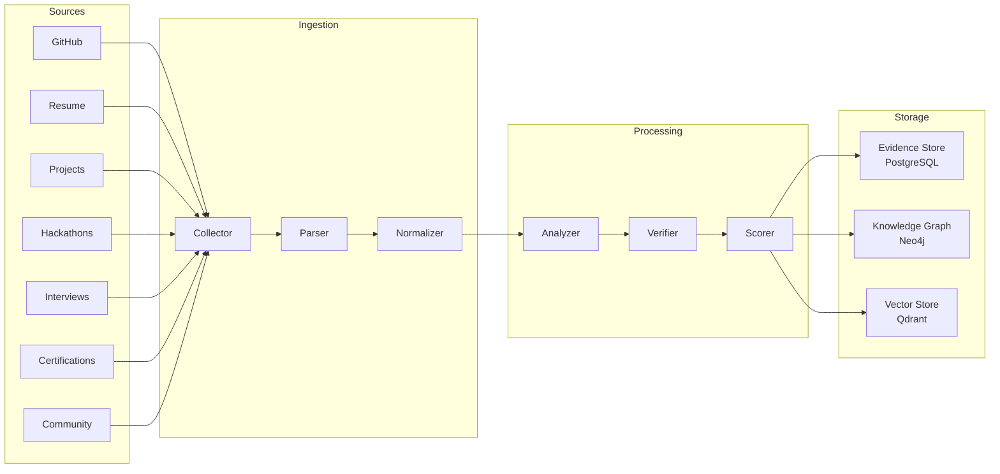
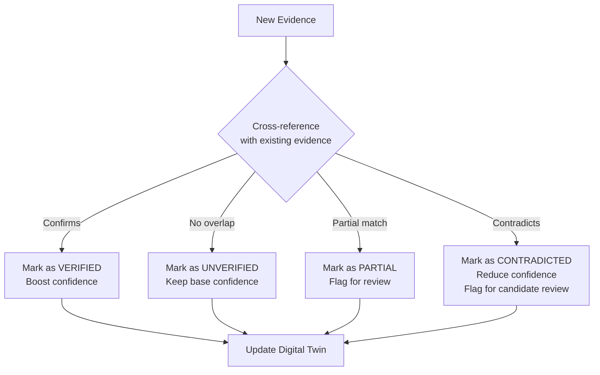

# Evidence Engine

## Overview

The Evidence Engine is the data ingestion and processing pipeline of TalentGraph AI. It transforms raw, unstructured technical work into structured, verified, and weighted evidence that powers the Professional Digital Twin.

---

## Evidence Pipeline



---

## Evidence Types

### GitHub Evidence

| Signal | Analysis Method | Output |
|--------|----------------|--------|
| Repository structure | AST parsing (Tree-sitter) | Architecture sophistication score |
| Commit history | Temporal analysis | Contribution patterns, consistency |
| Code quality | Static analysis | Maintainability, complexity metrics |
| Test coverage | Test file detection & analysis | Testing discipline score |
| PR reviews | NLP on review comments | Collaboration quality |
| Issues | NLP on issue descriptions | Communication, problem-solving |
| Dependencies | Dependency graph analysis | Technology proficiency mapping |
| README/Docs | Content analysis | Documentation quality |

### Resume Evidence

| Signal | Analysis Method | Output |
|--------|----------------|--------|
| Skills listed | NLP extraction | Claimed skill set |
| Work history | Structured extraction | Employment timeline |
| Education | Pattern matching | Degree, institution |
| Projects described | NLP extraction | Claimed project contributions |
| Certifications | Pattern matching | Certification list |

### Interview Evidence

| Signal | Analysis Method | Output |
|--------|----------------|--------|
| Audio responses | Whisper transcription | Text transcripts |
| Technical depth | LLM evaluation | Depth score per topic |
| Communication | LLM evaluation | Clarity, structure, articulation |
| Problem solving | LLM evaluation | Approach, reasoning quality |

---

## Evidence Artifact Schema

Every piece of processed evidence produces an **Evidence Artifact**:

```typescript
interface EvidenceArtifact {
  id: string;                    // Unique identifier
  candidateId: string;           // Owner
  source: EvidenceSource;        // GITHUB | RESUME | INTERVIEW | PROJECT | HACKATHON | CERTIFICATION | COMMUNITY
  type: EvidenceType;            // CODE | DOCUMENT | AUDIO | CERTIFICATE | CONTRIBUTION
  rawDataRef: string;            // Reference to raw source (URL, file path)
  processedAt: DateTime;         // When this artifact was created
  
  // Extracted intelligence
  skills: SkillEvidence[];       // Skills demonstrated by this evidence
  technologies: string[];        // Technologies identified
  qualityMetrics: QualityMetrics; // Quality assessment
  
  // Verification
  confidence: number;            // 0.0 - 1.0, how confident we are in this evidence
  verificationStatus: VerificationStatus; // VERIFIED | PARTIAL | UNVERIFIED | CONTRADICTED
  contradictions: Contradiction[]; // Any conflicts with other evidence
  
  // Metadata
  temporalRange: DateRange;      // When this work was done
  version: number;               // Artifact version (evidence is immutable, but re-processing creates new versions)
}
```

---

## Confidence Scoring

Not all evidence is equal. The Evidence Engine assigns confidence scores based on:

### Source Reliability

| Source | Base Confidence | Rationale |
|--------|----------------|-----------|
| GitHub (public repo, verified ownership) | 0.9 | Hard to fake at scale |
| Certification (verified issuer) | 0.85 | Third-party verification |
| Interview (AI-conducted) | 0.75 | Real-time assessment |
| Project (with live demo/repo) | 0.7 | Verifiable but partial |
| Hackathon (with submission proof) | 0.7 | Time-constrained, authentic |
| Resume (unverified) | 0.3 | Self-reported, no verification |
| Community (self-reported) | 0.4 | Partially verifiable |

### Confidence Modifiers

- **Cross-verification bonus**: +0.1 when evidence from one source confirms another (e.g., GitHub confirms resume skill claim).
- **Recency bonus**: Evidence from the last 12 months gets +0.05.
- **Depth bonus**: Detailed evidence (e.g., 50+ commits vs. 2 commits) gets up to +0.1.
- **Contradiction penalty**: -0.2 when evidence contradicts other sources.
- **Staleness penalty**: -0.05 per year of age beyond 2 years.

---

## Verification Pipeline



### Verification Examples

**Verified**: Resume says "3 years Go experience" → GitHub shows Go repos with commits spanning 3+ years → ✅ Verified

**Partial**: Resume says "Led microservice migration" → GitHub shows contributions to microservice repos, but commit messages don't indicate leadership → ⚠️ Partial

**Contradicted**: Resume says "Expert in Rust" → No Rust code found in any linked repository → ❌ Contradicted

---

## Processing Pipeline Details

### GitHub Processing

1. **Clone** — Shallow clone of the repository
2. **Language Detection** — Identify primary and secondary languages
3. **AST Parsing** — Parse source files using Tree-sitter for structural analysis
4. **Complexity Analysis** — Calculate cyclomatic complexity, coupling, cohesion
5. **Architecture Detection** — Identify patterns (MVC, microservices, event-driven)
6. **Commit Analysis** — Parse commit history for contribution patterns
7. **Dependency Analysis** — Parse package files for technology mapping
8. **Quality Assessment** — Evaluate test presence, documentation, error handling
9. **Evidence Generation** — Create structured evidence artifacts
10. **Embedding Generation** — Create vector embeddings for semantic search
11. **Graph Update** — Update Knowledge Graph with new nodes and edges

### Resume Processing

1. **Upload** — Accept PDF or image upload
2. **OCR** — Extract text using PaddleOCR (for scanned/image resumes)
3. **Structured Extraction** — Parse into sections (skills, experience, education)
4. **Entity Recognition** — Identify skills, technologies, companies, roles
5. **Timeline Construction** — Build employment timeline
6. **Claim Extraction** — Identify specific, verifiable claims
7. **Cross-Verification** — Compare claims against existing evidence
8. **Evidence Generation** — Create evidence artifacts with verification status

---

## Evidence Retention and Privacy

1. **Raw data is never stored permanently.** GitHub repos are cloned, analyzed, and deleted. Only processed evidence artifacts are retained.
2. **Candidates control their evidence.** They can remove any evidence source at any time.
3. **Evidence deletion cascades.** Removing an evidence source triggers a Digital Twin recalculation.
4. **Audit trail.** Every evidence processing action is logged for transparency.

---

## Future Evidence Sources

| Source | Status | Priority |
|--------|--------|----------|
| GitHub | MVP | P0 |
| Resume | MVP | P0 |
| AI Interview | MVP | P1 |
| Project Links | MVP | P1 |
| Certifications | Post-MVP | P2 |
| Hackathon Submissions | Post-MVP | P2 |
| Technical Blog Posts | Future | P3 |
| Conference Talks | Future | P3 |
| Stack Overflow | Future | P3 |
| npm/PyPI Packages | Future | P3 |
