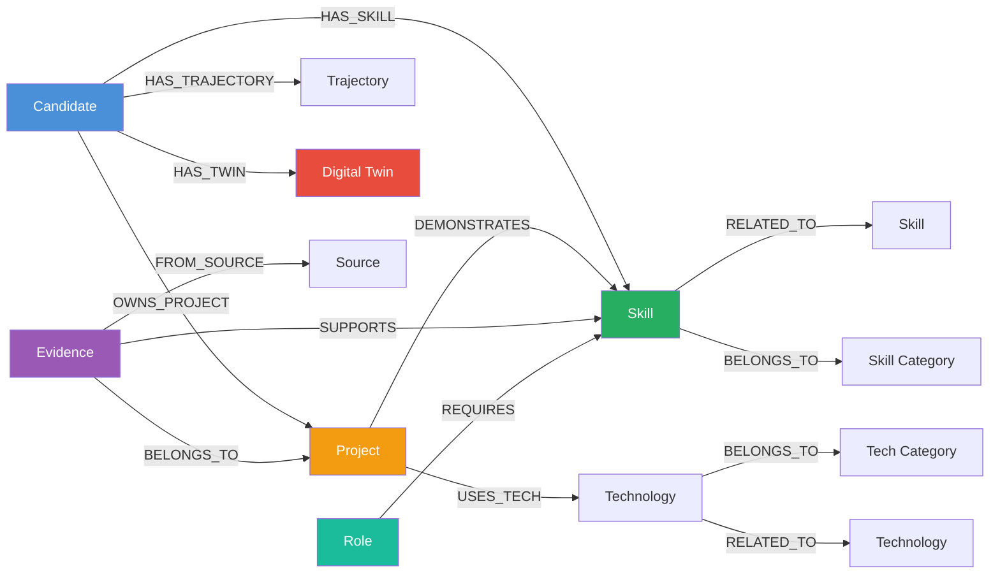
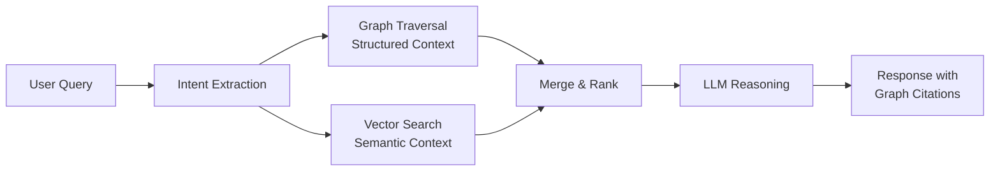

# Knowledge Graph

## Overview

The Knowledge Graph is the structured intelligence backbone of TalentGraph AI. It models the relationships between candidates, skills, technologies, projects, and evidence in a graph database (Neo4j), enabling rich traversal queries that would be impossible in a relational model.

---

## Why a Graph?

Professional capabilities are inherently relational:

- A **candidate** *has* **skills** at different *proficiency levels*
- A **project** *demonstrates* **skills** and *uses* **technologies**
- A **technology** *belongs to* a **category** and *relates to* other **technologies**
- **Evidence** *supports* **skills** with varying *confidence*
- **Roles** *require* **skills** at specific *proficiency thresholds*

Relational databases flatten these relationships into join tables. Graph databases preserve them as first-class entities, enabling queries like:

- "Which candidates have skills that are 2 hops from Kubernetes?" (i.e., skills closely related to Kubernetes)
- "What is the shortest path between Candidate A's current skills and Role X's requirements?"
- "Which skills form clusters in Candidate B's profile?" (specialization detection)

---

## Schema



---

## Node Types

### Candidate
```cypher
(:Candidate {
  id: String,
  name: String,
  email: String,
  created_at: DateTime,
  updated_at: DateTime,
  twin_status: String  // SEED | GROWING | MATURE | STALE
})
```

### Skill
```cypher
(:Skill {
  id: String,
  name: String,           // e.g., "Go", "Distributed Systems", "API Design"
  category: String,       // e.g., "Language", "Architecture", "Practice"
  subcategory: String,    // e.g., "Backend Language", "System Design"
  canonical_name: String  // Normalized name for deduplication
})
```

### Technology
```cypher
(:Technology {
  id: String,
  name: String,         // e.g., "PostgreSQL", "Docker", "React"
  category: String,     // e.g., "Database", "DevOps", "Frontend Framework"
  ecosystem: String     // e.g., "JavaScript", "Python", "Go"
})
```

### Project
```cypher
(:Project {
  id: String,
  name: String,
  url: String,
  description: String,
  complexity_score: Float,    // 0.0 - 1.0
  contribution_type: String,  // SOLO | LEAD | CONTRIBUTOR
  stars: Integer,
  last_activity: DateTime
})
```

### Evidence
```cypher
(:Evidence {
  id: String,
  source: String,          // GITHUB | RESUME | INTERVIEW | etc.
  type: String,            // CODE | DOCUMENT | AUDIO | etc.
  confidence: Float,       // 0.0 - 1.0
  verification: String,    // VERIFIED | PARTIAL | UNVERIFIED | CONTRADICTED
  processed_at: DateTime,
  temporal_start: DateTime,
  temporal_end: DateTime
})
```

### Role
```cypher
(:Role {
  id: String,
  title: String,           // e.g., "Senior Backend Engineer"
  level: String,           // JUNIOR | MID | SENIOR | STAFF | PRINCIPAL
  domain: String           // e.g., "Backend", "Frontend", "ML", "DevOps"
})
```

---

## Relationship Types

### HAS_SKILL
```cypher
(candidate)-[:HAS_SKILL {
  proficiency: String,     // BEGINNER | INTERMEDIATE | ADVANCED | EXPERT
  confidence: Float,       // 0.0 - 1.0
  evidence_count: Integer,
  first_seen: DateTime,
  last_seen: DateTime,
  growth_velocity: Float   // Rate of proficiency change
}]->(skill)
```

### DEMONSTRATES
```cypher
(project)-[:DEMONSTRATES {
  evidence_strength: Float,  // How strongly this project demonstrates the skill
  context: String            // Brief description of how the skill is demonstrated
}]->(skill)
```

### REQUIRES
```cypher
(role)-[:REQUIRES {
  min_proficiency: String,  // Minimum required proficiency level
  weight: Float,            // How important this skill is for the role (0.0 - 1.0)
  mandatory: Boolean        // Is this a hard requirement?
}]->(skill)
```

### RELATED_TO
```cypher
(skill)-[:RELATED_TO {
  strength: Float,    // 0.0 - 1.0, how closely related
  type: String        // COMPLEMENTARY | PREREQUISITE | ALTERNATIVE | SUBSET
}]->(skill)
```

---

## Example Queries

### "What are Candidate X's strongest skills?"
```cypher
MATCH (c:Candidate {id: $candidateId})-[r:HAS_SKILL]->(s:Skill)
WHERE r.confidence > 0.5
RETURN s.name, r.proficiency, r.confidence, r.evidence_count
ORDER BY r.confidence DESC, r.evidence_count DESC
LIMIT 10
```

### "How ready is Candidate X for a Senior Backend role?"
```cypher
MATCH (role:Role {title: 'Senior Backend Engineer'})-[req:REQUIRES]->(skill:Skill)
OPTIONAL MATCH (c:Candidate {id: $candidateId})-[has:HAS_SKILL]->(skill)
RETURN skill.name, 
       req.min_proficiency, 
       req.weight,
       COALESCE(has.proficiency, 'NONE') AS candidate_proficiency,
       COALESCE(has.confidence, 0) AS confidence
ORDER BY req.weight DESC
```

### "Find candidates similar to Candidate X"
```cypher
MATCH (c1:Candidate {id: $candidateId})-[:HAS_SKILL]->(s:Skill)<-[:HAS_SKILL]-(c2:Candidate)
WHERE c1 <> c2
WITH c2, COUNT(DISTINCT s) AS shared_skills
ORDER BY shared_skills DESC
LIMIT 10
RETURN c2.name, shared_skills
```

### "What skills are closely related to Kubernetes?"
```cypher
MATCH (s:Skill {name: 'Kubernetes'})-[:RELATED_TO*1..2]-(related:Skill)
RETURN DISTINCT related.name, related.category
```

---

## Graph Maintenance

### Skill Taxonomy

The graph includes a curated **Skill Taxonomy** — a hierarchy of skills and their relationships that serves as the canonical reference for skill normalization.

```
Engineering
├── Languages
│   ├── Go, Python, TypeScript, Rust, Java, ...
├── Frameworks
│   ├── React, Next.js, FastAPI, Django, ...
├── Databases
│   ├── PostgreSQL, Redis, Neo4j, MongoDB, ...
├── Architecture
│   ├── Microservices, Event-Driven, Serverless, ...
├── Practices
│   ├── TDD, CI/CD, Code Review, Documentation, ...
├── DevOps
│   ├── Docker, Kubernetes, Terraform, ...
└── Domains
    ├── Distributed Systems, ML/AI, Security, ...
```

### Deduplication

Skills are normalized to canonical names to prevent fragmentation:

- "JS" → "JavaScript"
- "k8s" → "Kubernetes"
- "Postgres" → "PostgreSQL"
- "React.js" → "React"

### Graph Updates

1. **Additive by default.** New evidence adds nodes and edges; it never deletes existing ones.
2. **Confidence updates.** When new evidence confirms existing skills, confidence scores increase.
3. **Contradiction handling.** Conflicting evidence flags relationships for review rather than removing them.
4. **Periodic recalculation.** Weekly batch job recalculates derived metrics (growth velocity, staleness decay).

---

## GraphRAG Integration

The Knowledge Graph powers **GraphRAG** — a retrieval strategy that combines graph traversal with vector similarity search.



**Why both?**

- **Graph traversal** provides structured, relationship-aware context: "Candidate X has skill Y demonstrated by project Z."
- **Vector search** provides semantic context: "This code snippet is similar to production-grade microservice patterns."
- **Combined**, they produce richer, more accurate responses than either alone.

---

## Future Enhancements

- **Temporal graph queries**: "Show me how Candidate X's skills evolved over the last 2 years."
- **Community detection**: Identify clusters of related skills to suggest specialization paths.
- **Influence propagation**: When a candidate demonstrates a parent skill, propagate partial confidence to child skills.
- **Graph embeddings**: Train graph neural networks on the skill graph for more nuanced similarity matching.
